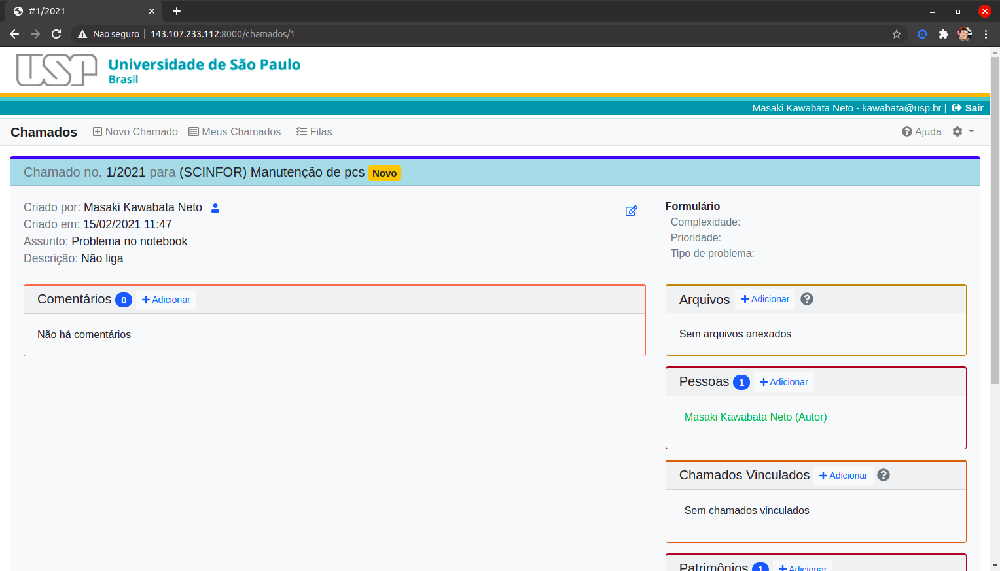
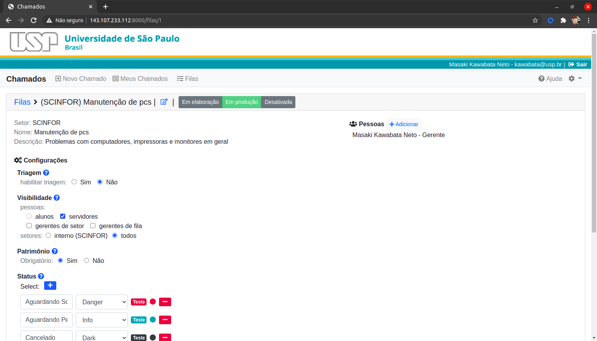

# Sobre o projeto

Sistema que gerencia o fluxo de chamados técnicos ou solicitações de atendimento. Foi idealizado para chamados de informática e de zeladoria (manutenção predial) mas pode ser estendido a quaisquer outros serviços. Todas as atividades são notificadas por email aos interessados.

Características:

-   Múltiplas filas de atendimentos
    -   com ou sem triagem
    -   controle de visibilidade por categoria de pessoas
    -   formulário de chamado personalizado
    -   cadastro de gerentes e atendentes
    -   organizado por setores
-   Chamado com várias opções
    -   Suporte a arquivos anexos
    -   Permite vincular chamados
    -   Permite cadastrar observadores
    -   Permite referenciar patrimônios USP
-   Autenticação por senha única

## Prints

### Tela de chamado

### Tela de fila

## Requisitos

Esse sistema foi projetado para rodar em servidores linux (Ubuntu e Debian).

-   PHP 7.3
-   Apache ou Nginx
-   Banco de dados local (MariaDB mas pode ser qualquer um suportado pelo Laravel)
-   Git
-   Composer
-   Credenciais para senha única
-   Acesso ao replicado

Bibliotecas necessárias do php:

    apt install php-sybase php-mysql php-xml php-intl php-mbstring php-gd php-curl

## Instalação

    git clone git@github.com:uspdev/chamados
    composer install
    cp .env.example .env
    php artisan key:generate

Criar user e banco de dados (em mysql):

    sudo mysql
    create database chamados;
    grant all privileges on chamados.* to chamados@'%' identified by 'chamados';
    flush privileges;

## Configuração em ambiente de produção

### Configurar o cache

A bibliteca (https://github.com/uspdev/cache) usada no replicado utiliza o servidor memcached. Se você pretende utilizá-lo instale e configure ele:

    apt install memcached
    vim /etc/memcached.conf
        I = 5M
        -m 128

    /etc/init.d/memcached restart

### Email

Configurar a conta de email para acesso menos seguro pois a conexão é via smtp.

### Configurar o apache ou nginx

Deve apontar para a \<pasta do projeto\>/public, assim como qualquer projeto laravel.

No Apache é possivel utilizar a extensão MPM-ITK (http://mpm-itk.sesse.net/) que permite rodar seu *Servidor Virtual* com usuário próprio. Isso facilita rodar o sistema como um usuário comum e não precisa ajustar as permissões da pasta `storage/`.

    sudo apt install libapache2-mpm-itk
    sudo a2enmod mpm_itk
    sudo service apache2 restart 

Dentro do seu virtualhost coloque

    <IfModule mpm_itk_module>
    AssignUserId nome_do_usuario nome_do_usuario
    </IfModule>

### Configurar senha única

Cadastre uma nova URL no configurador de senha única utilizando o caminho `/callback`. Guarde o callback_id para colocar no arquivo `.env`.

### Edite o arquivo .env

Há várias opções que precisam ser ajustadas nesse arquivo. Faça com atenção para não deixar passar nada. O arquivo está todo documentado.

### Popular banco de dados

    php artisan migrate

Os setores e respectivos designados podem ser importados do Replicado.  Para isso rode:

    php artisan db:seed --class=SetorReplicadoSeeder

Depois de importado faça uma conferência para não haver inconsistências.
### Instalar e configurar o Supervisor

Para as filas de envio de email o sistema precisa de um gerenciador que mantenha rodando o processo que monitora as filas. O recomendado é o **Supervisor**. No Ubuntu ou Debian instale com:

    sudo apt install supervisor

Para gerar o arquivo de configuração e colocar na pasta apropriada (`/etc/supervisor/conf.d/`) rode como **`root`**

    sudo php artisan supervisor:queue

Ajustes necessários: por enquanto é necessário ajustar no arquivo gerado:

    user=<username>
    redirecionar stderr_logfile = <aplicacao>/storage/logs/<seu arquivo de log>

Reinicie o **Supervisor**

    sudo supervisorctl reread
    sudo supervisorctl update
    sudo supervisorctl restart all

### Atualização em produção

Para receber as últimas atualizações do sistema rode:

    git pull
    composer install
    php artisan migrate

Caso tenha alguma atualização, não deixe de conferir o readme.md quanto a outras providências que podem ser necessárias.

## Configuração em ambiente de desenvolvimento

Ainda é preciso descrever melhor mas pode seguir as instruções para ambiente de produção com os ajustes necessários.

    php artisan migrate:fresh --seed

O senhaunica-fake pode não ser adequado pois o sistema coloca as pessoas nos respectivos setores com as informações da senha única.

Para subir o servidor

    php artisan serve

**CUIDADO**: você pode enviar emails indesejados para as pessoas.

Para enviar emails é necessário executar as tarefas na fila.   Para isso, em outro terminal rode

    php artisan queue:listen

## Problemas e soluções

Ao rodar pela primeira vez com apache, as variáveis de ambiente relacionadas ao replicado não ficam disponíveis. Nesse caso é necessário restartar o apache.

https://www.php.net/manual/pt_BR/function.getenv.php#117301

Para limpar e recriar todo o DB, rode sempre que necessário:

    php artisan migrate:fresh --seed

## Histórico

* O sistema de chamados foi transferido da FFLCH para o USPDev.
  * Adaptar para o uso por várias unidades
  * Expandir para o uso por outros setores como por exemplo o serviço de manutenção
  * Implementado conceito de filas

## Detalhamento técnico

Foram utilizados vários recursos do laravel que podem não ser muito trivial para todos.

* O monitoramento de novos chamados ou novas mensagens nos chamados é feito usando *observers* (https://laravel.com/docs/8.x/eloquent#observers)
* Os emails enviados são colocados em filas (jobs) para liberar a execução do php (https://laravel.com/docs/8.x/mail#queueing-mail)

## Todo

* Monitorar jobs com falhas
* Monitorar arquivos de log